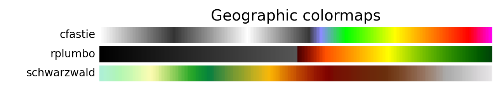
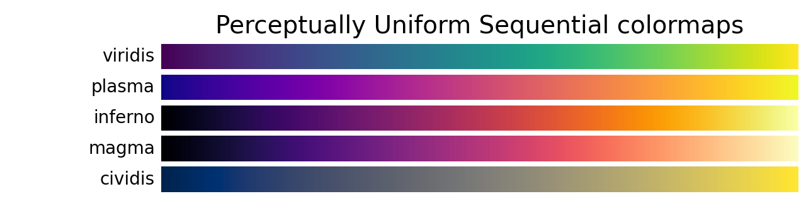

# Colormaps

Rio-tiler includes many colormaps, some derived from Matplotlib and some custom
ones that are commonly-used with raster data.

You can load a colormap with `rio_tiler.colormap.get_colormap`, and then pass it
to `rio_tiler.utils.render`:

```py
from rio_tiler.colormap import get_colormap
from rio_tiler.utils import render

colormap = get_colormap('cfastie')
render(tile, mask, colormap=colormap)
```




.png)


### Update images for new colormaps

To regenerate these images for new colormaps, update the list of colormaps at
the top of `scripts/colormap_thumb.py` and then run

```bash
python scripts/colormap_thumb.py
```
