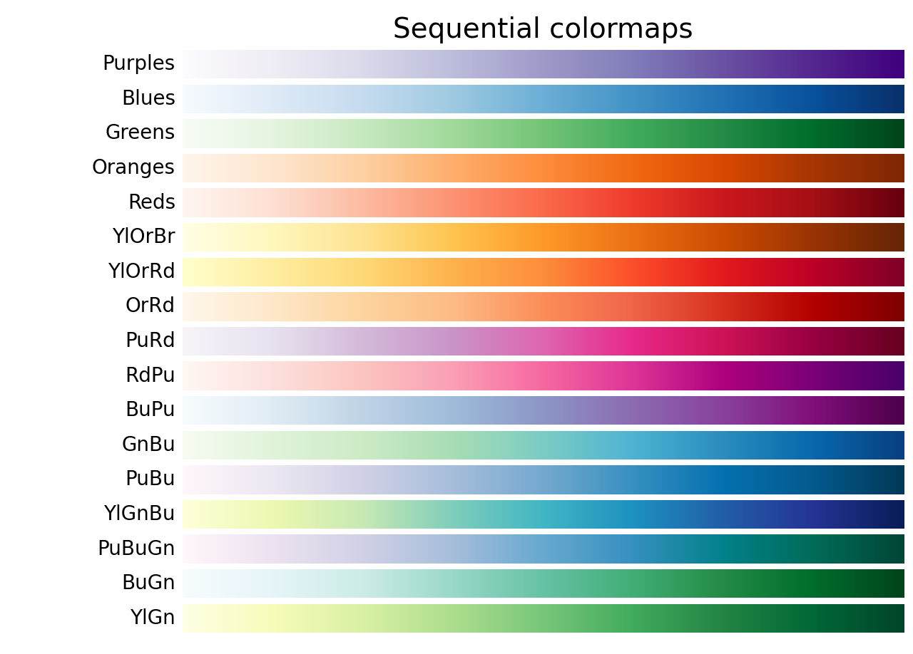
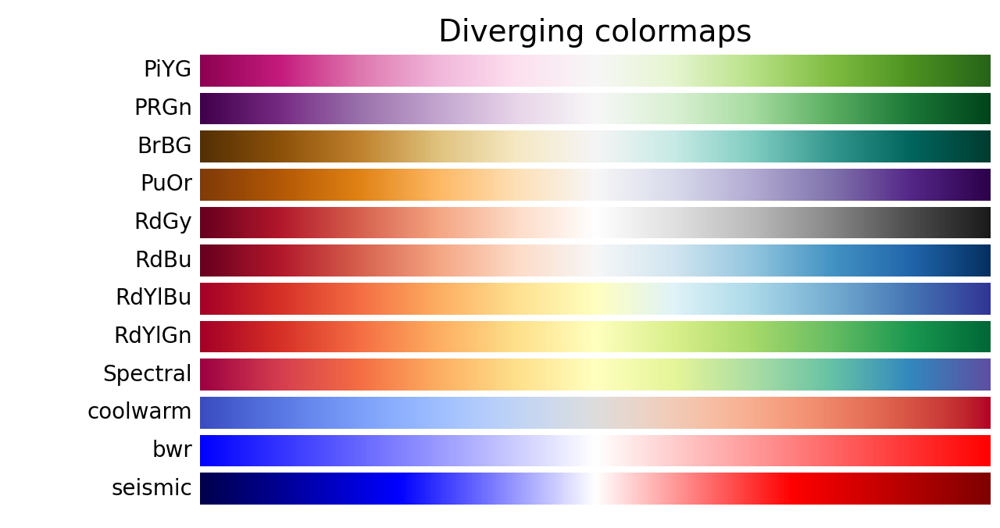

# Colormaps

Rio-tiler includes many colormaps, some derived from Matplotlib and some custom
ones that are commonly used with raster data.

You can load one of `rio-tiler`'s default colormaps from the `rio_tiler.colormap.cmap` object, and then pass it
to `rio_tiler.utils.render`:

```python
from rio_tiler.colormap import cmap
from rio_tiler.io import Reader

# Get Colormap
# You can list available colormap names with `cmap.list()`
cm = cmap.get("cfastie")

with Reader(
  "https://sentinel-cogs.s3.amazonaws.com/sentinel-s2-l2a-cogs/29/R/KH/2020/2/S2A_29RKH_20200219_0_L2A/B01.tif",
) as src:
    img = src.tile(239, 220, 9)

    # Rescale the data linearly from 0-10000 to 0-255
    img.rescale(
        in_range=((0, 10000),),
        out_range=((0, 255),)
    )

    # Apply colormap and create a PNG buffer
    buff = img.render(colormap=cm) # this returns a buffer (PNG by default)
```

The `render` method accept colormap in form of:
```python
{
  value1: (R, G, B, Alpha),
  value2: (R, G, B, Alpha),
  ...
}
```

Colormaps can be `discrete` (having sparse value) or `linear` (with values strictly from 0 to 255).

### Custom colormaps

The `rio_tiler.colormap.cmap` object holds the list of default colormaps and also allow users to registered new ones.

**discrete** (with custom entries, not limited to uint8 type)

```python
from rio_tiler.colormap import cmap

cmap = cmap.register(
    {
        "custom_classes": {
          0: (0, 0, 0, 0),
          100: (255, 0, 0, 255),
          200: (0, 255, 0, 255),
          300: (0, 0, 255, 255),
        }
    }
)
```

**linear** (with 256 values from 0 to 255)

```python
# ref: https://github.com/cogeotiff/rio-tiler/issues/382
import matplotlib
import numpy

ndvi = matplotlib.colors.LinearSegmentedColormap.from_list(
    'ndvi', [
        '#422112',
        '#724C01',
        '#CEA712',
        '#FFA904',
        '#FDFE00',
        '#E6EC06',
        '#BACF00',
        '#8BB001',
        '#72A002',
        '#5B8D03',
        '#448102',
        '#2C7001',
        '#176100',
    ],
    256,
)

x = numpy.linspace(0, 1, 256)
cmap_vals = ndvi(x)[:, :]
cmap_uint8 = (cmap_vals * 255).astype('uint8')
ndvi_dict = {idx: tuple(value) for idx, value in enumerate(cmap_uint8)}

cmap = cmap.register({"ndvi": ndvi_dict})
```

### Intervals colormaps

Starting with `rio-tiler` 3.0, *intervals* colormap support has been added. This is useful when you want to define color breaks for a given data.

!!! warnings
    For `intervals`, colormap has to be in form of `Sequence[Tuple[Sequence, Sequence]]`:
    ```
    [
      ((min, max), (r, g, b, a)),
      ((min, max), (r, g, b, a)),
      ...
    ]
    ```

```python
from rio_tiler.colormap import apply_cmap

data = numpy.random.randint(0, 255, size=(1, 256, 256))
cmap = [
    ((0, 1), (0, 0, 0, 0)),
    ((1, 10), (255, 255, 255, 255)),
    ((10, 100), (255, 0, 0, 255)),
    ((100, 256), (255, 255, 0, 255)),
]

data, mask = apply_cmap(data, cmap)
```

### Default rio-tiler's colormaps



.png)



### References

- Matplotlib colormaps: <https://matplotlib.org/3.1.0/tutorials/colors/colormaps.html>
- `cfastie`: <http://publiclab.org/notes/cfastie/08-26-2014/new-ndvi-colormap>
- `rplumbo`: <https://github.com/cogeotiff/rio-tiler/pull/90>
- `schwarzwald`: <http://soliton.vm.bytemark.co.uk/pub/cpt-city/wkp/schwarzwald/tn/wiki-schwarzwald-cont.png.index.html>

### Update images for new colormaps

To regenerate these images for new colormaps, update the list of colormaps at
the top of `docs/scripts/colormap_thumb.py` and then run

```bash
python docs/scripts/colormap_thumb.py
```
