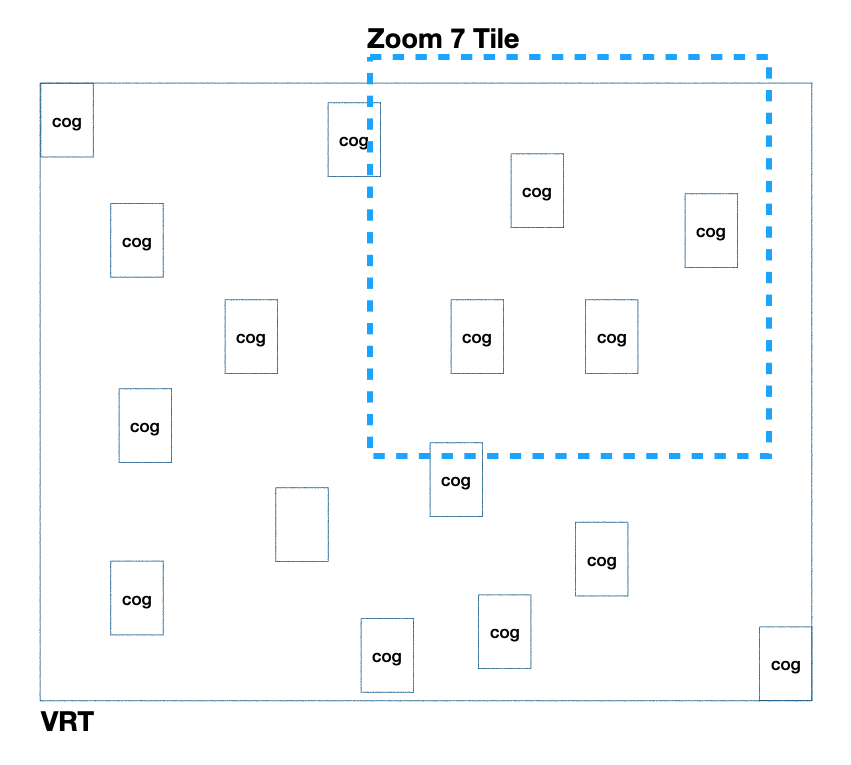

`rio-tiler` can work with all raster formats supported by [GDAL](https://gdal.org). That's being said, `rio-tiler` works better with data format that supports **partial reading**, like [Cloud Optimized GeoTIFF](http://cogeo.org).

On interesting feature of Cloud Optimized GeoTIFF is the internal overviews which enable fast preview of the data. For example, when using the `COGReader.preview` method, rio-tiler will only fetch the internal overviews instead of the whole data, to be able to construct the output array. Doing this reduce the amount of data transfer and thus increase the process speed.

### VRT

GDAL's [Virtual format](https://gdal.org/drivers/raster/vrt.html#raster-vrt) is also supported by rio-tiler.

!!! warnings
    Map Tile reading from VRT might not be efficient if overviews are not present, because GDAL will try to open a lot of files.

